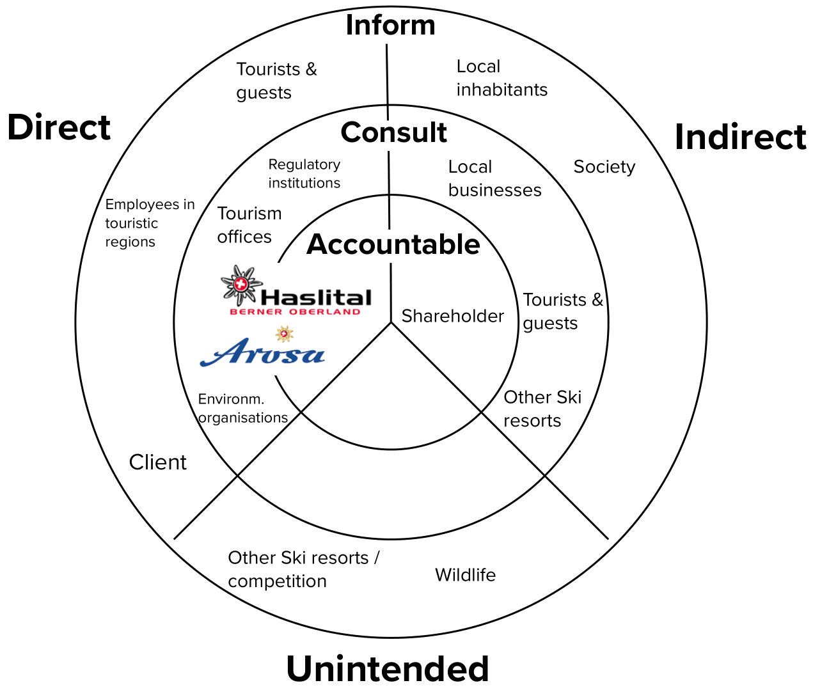
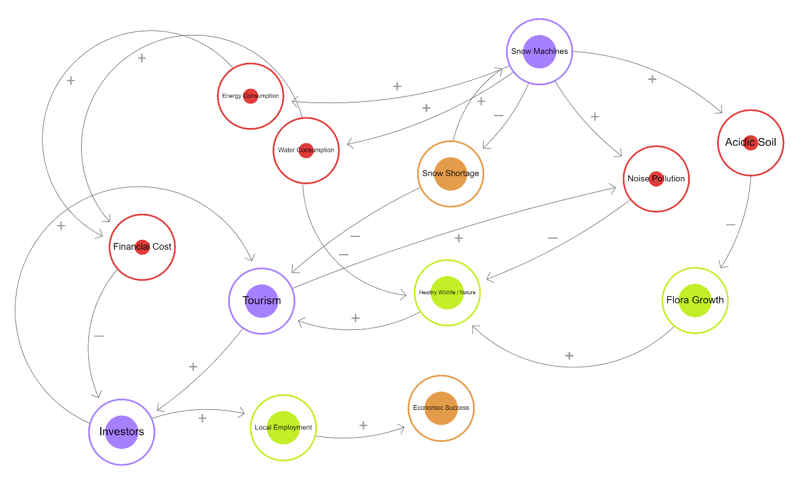
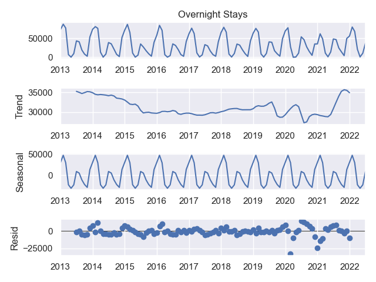
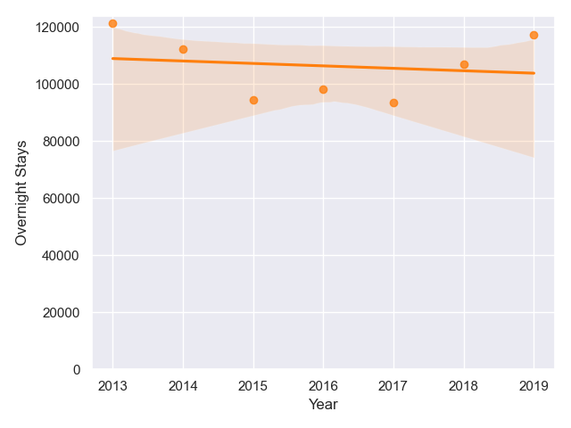
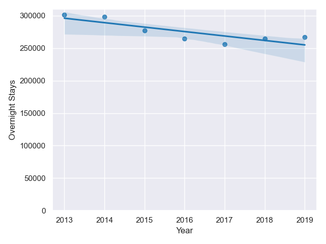
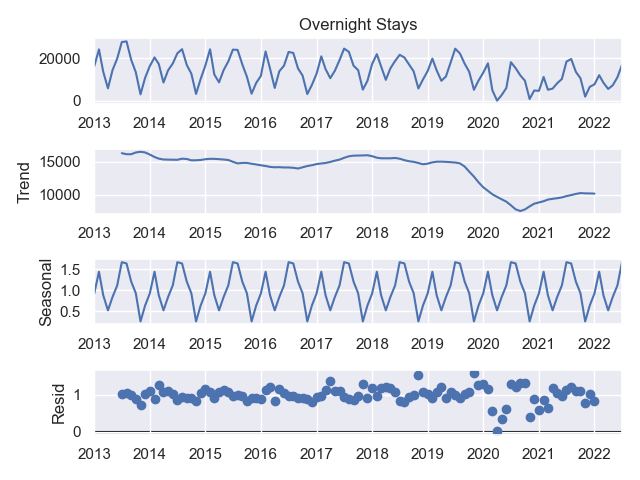
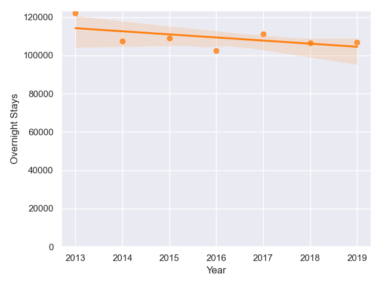
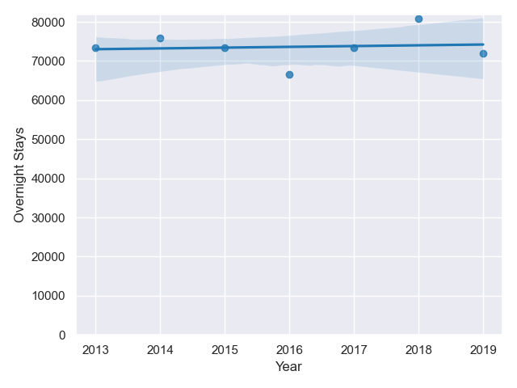

# Sustainability Analytics

### Kurze Einführung in Git:

**Init**
```bash
git clone https://github.com/j4yk4y/sustainability_analytics.git
```

**Arbeiten mit Git**

- git pull: lädt die neuste Versionm des Repo herunter
- git add "Dateiname.xy": Wenn eine Datei geändert wurde, muss man diesen Befehl schreiben
- git commit -m "hier schreiben, was geändert wurde"
- git push: Gibt den Befehl, die Änderungen in die Main Fork hochzuladen

### Instruction to open the Dashboard

```bash
pip install -r requirements.txt
```

```python
streamlit run app.py
```

#### Setup 
packages from requirements.txt\
Python 3.9

## Report - Sustainable Ski Resorts - Arosa & Meiringen / Haslital
### 1. Introduction to the topic (Daniel)
During recent times, everyone can feel the impact of global warming on the planet and our everyday lifes. Although western societies are privileged in terms of their capacities and resources to take measures against global warming, they are also highly responsible to do so- mainly, because they emitted a large portion of the artificially released atmospheric greenhouse gases, both in the past and today. According to Lenzen et al. (2018) global tourism is the source of about 8% of human-made CO<sub>2</sub> emissions, with growing tendency. Although the share of alpine tourism to that number is not fully clear, it is one of the main touristic branches in Switzerland and therefore offers potential for our society to have an impact on global emission reduction. Furthermore, it has an impact on regional biodiversity, energy consumption, noise pollution, water usage as well as contamination levels of soil and ground. At the same time, tourism is one of the main sources of income for many people, also in Switzerland.
For this reason, the Arosa and Meiringen / Hasliberg Ski Resorts have kindly asked us to support with data generation and analysis in order to take and control measures, understand correlations and steer investments towards a more sustainable and future-oriented vision of recreational alpine areas, with  minimized environmental impact and maximized economical and societal benefit.

This report summarizes the first iteration of the project, which includes a presentation about the general settings and the framework of the project, applied methods for a structural analysis of stakeholders and context, gathered data about snow fall, temperature and overnight stays in the analyzed regions as well as the presentation of the Dashboard MVP with initial results of the visual data analysis and as a last step, limitations and next steps to be taken.

#### 1.1. SDGs (Daniel)
When it comes to sustainability, the overarching framework all measures should be oriented on are the 17 Sustainable Development Goals (SDGs) defined by the UN. This Framework of development goals was finally accepted by all member-countries of the UN in 2015 and acts as a blueprint for peace and prosperity for people and the planet. The 17 goals consist of 169 targets, which all ratifying countries should aim for until 2030. 
In the context of this project, we also want to orientate on the SDGs and identified several of them as strongly interconnected with the alpine recreational context, which are the following:
<br>

- **Goal 13: Climate Action**
- **Goal 9:  Industry, Innovation and Infrastructure**
- **Goal 12: Responsible Consumption and Production**
- **Goal 15: Life on Land**
<br>

**Climate Action**
<br>
Climate Action is one of the main topics of sustainable development. The topic summarizes everything in the context of environmental protection and global warming, one of the biggest challenges of humanity ever. This man-made problem needs to be solved and taken seriously, which is also our responsibility and overarching thread of this project.

**Industry, Innovation and Infrastructure**
<br>
Since changing the status quo and solving challenges with smart solutions asks for innovative ideas and products, this SDG is also clearly part of the path to sustainable alpine tourism. Impact can be generated through both innovative ideas and approaches to tourism and it's future form in general, but also with efficient and sophisticated solutions that minimize environmental impact through efficiency and indulgent utilization of resources. 

**Responsible Consumption and Production**
<br>
Tourism is one form of consumption, that most people in our modern society conduct. As stated above, about 8% of the global emission are routed here. Offering sustainable products, both physical and emotional, combined with a responsible consumption and use of recreational opportunities leads to an overall more sustainable future.

**Life on Land**
<br>
Alpine regions and ski resorts are situated around mountains, in this case within the alps. This region largely defines the swiss geography and landscape, offers immense economical and touristic value while also serving as home to great numbers of individual species and biodiversity. Maintaining this balance of interests, which means both protecting the home of an abundance of animals and plants, while also allowing residents and society to enjoy and utilize the great potential of mountainous regions. This balance is crucial for sustainability within alpine regions and in the interest of all. 

#### 1.2 Indicators in another framework
xxx (alle)

#### 1.3 relevant regulations
xxx (Simon)

#### 1.4 Sustainability trends
xxx (Simon) 

### 2. Methods
#### 2.1 Stakeholder Analysis (Daniel)
The overall framework of the project also includes a variety of stakeholders with different interests and goals. To picture the different groups, we created a Stakeholder-map:
<br>


The map is split into three overall categories: direct, indirect and unintended Stakeholders. These groups are then again split into three categories of their relationship towards the project: accountable, to be consulted and to be informed. The most important, direct Stakeholders are the two resorts themselves, Arosa & Meiringen / Hasliberg. They are the initiators of the project, steer important decisions and will employ potential future solutions. 

#### 2.2 System Dynamics
As a continuation of the stakeholder analysis, the relationships between the various stakeholders can be modeled. In this report, we have created a system model to show the impact of snow shortage on the economic success of a region. 
Affected stakeholders and processes in the social, industrial, and environmental sectors have been considered.
In the model the input and output variable is colored orange, the positive nodes are colored green, the negative nodes are colored red and the neutral nodes are colored purple.
<br>
Under the following link the simulation can be started: [Loopy](https://ncase.me/loopy/v1.1/?data=[[[1,1073,68,0.5,%22Snow%2520Machines%22,5],[2,913,288,0.5,%22Snow%2520Shortage%22,1],[3,653,246,0.16,%22Water%2520Consumption%22,0],[4,1353,516,0.5,%22Flora%2520Growth%22,3],[5,1453,232,0.16,%22Acidic%2520Soil%22,0],[6,1283,297,0.16,%22Noise%2520Pollution%22,0],[7,907,502,0.5,%22Healthy%2520Wildlife%2520%252F%2520Nature%22,3],[8,573,517,0.5,%22Tourism%22,5],[9,217,770,0.5,%22Investors%22,5],[10,612,745,0.5,%22Local%2520Employment%22,3],[11,896,710,0.5,%22Economoc%2520Success%22,1],[12,524,146,0.16,%22Energy%2520Consumption%22,0],[13,304,389,0.16,%22Financial%2520Cost%22,0]],[[1,3,34,1,0],[1,6,-25,1,0],[2,1,49,1,0],[1,2,26,-1,0],[1,5,51,1,0],[5,4,33,-1,0],[4,7,127,1,0],[6,7,22,-1,0],[3,7,-102,-1,0],[7,8,59,1,0],[8,9,22,1,0],[9,10,37,1,0],[10,11,-34,1,0],[2,8,-21,-1,0],[1,12,43,1,0],[12,13,-296,1,0],[3,13,-310,1,0],[13,9,-78,-1,0],[9,8,362,1,0],[8,6,19,1,0]],[[1478,696,%22Orange%253A%2520Input%2520and%2520Output%2520Variable%250AGreen%253A%2520Positive%2520Variable%250ARed%253A%2520Negative%2520Variable%250APurple%253A%2520Neutral%2520Variable%22],[1015,300,%22Input%22],[1026,719,%22Output%22]],13%5D)


### 3. Data
#### 3.1. Snow Days
xxx (Remo)

#### 3.2. Temperature (Daniel)
xxx (Daniel)

#### 3.3. Overnight Stays
For overnight stays, data was drawn from the [STAT-TAB](https://www.bfs.admin.ch/bfs/en/home/services/recherche/stat-tab-online-data-search.html) of the Federal Statistical Office.
This tool was used to download the number of overnight stays in Arosa and Meiringen on a monthly basis between 2013 and 2022.
For the analysis, the data from Meiringen and Hasliberg was added together, as it is a combined ski region.
First, a time series was formed, which was broken down into trend, seasonality and noise.
Furthermore, an additional "season" variable was created. This shows whether a month is a winter or summer month. May to October is defined as summer and November to April as winter.
For each season, the trend between 2013 and 2019 was analyzed. The years affected by the corona pandemic were intentionally omitted because they are highly divergent due to external influences. 

### 4. Results
#### 4.1 Snow Days
xxx (Remo)

#### 4.2 Temperature
xxx (Daniel)

#### 4.3 Overnight Stays
**Arosa**
<br>




Summer             |  Winter
:-------------------------:|:-------------------------:
  |  


**Meiringen/Hasliberg**
i<br>



Summer             |  Winter
:-------------------------:|:-------------------------:
  |  


### 5. Conclusion
#### 5.1. Outlook
xxx (Remo)

#### 5.2. Limitations
xxx (Remo)

#### 5.3. Reflection/Learnings
xxx (Wer Lust hat)

## Requirements
- Contain results (don't aspire too high)
- Contain results based on adequate data 
- Use appropriate methods and justify the choice 
- Refer to the relevant SDGs or indicators in another framework 
- Consider the relevant regulations and sustainability trends 
- Critically discuss the significance and the relevance of the results 
- Contain an outlook, showing 
- how to address the shortcomings of the preliminary results, and 
- which follow-up issues can be solved using which method 
